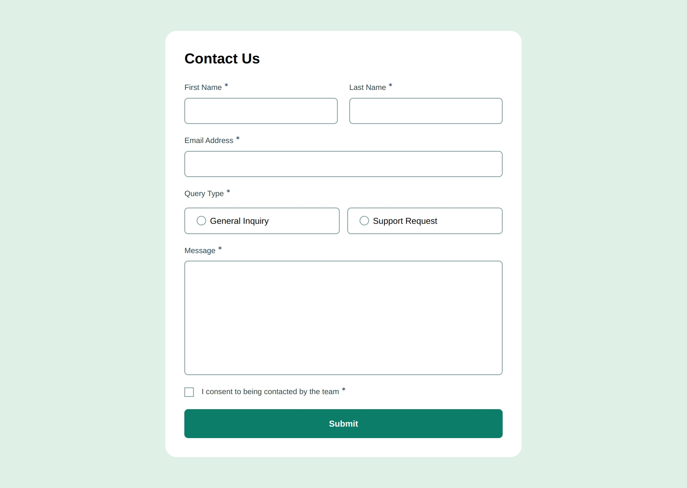
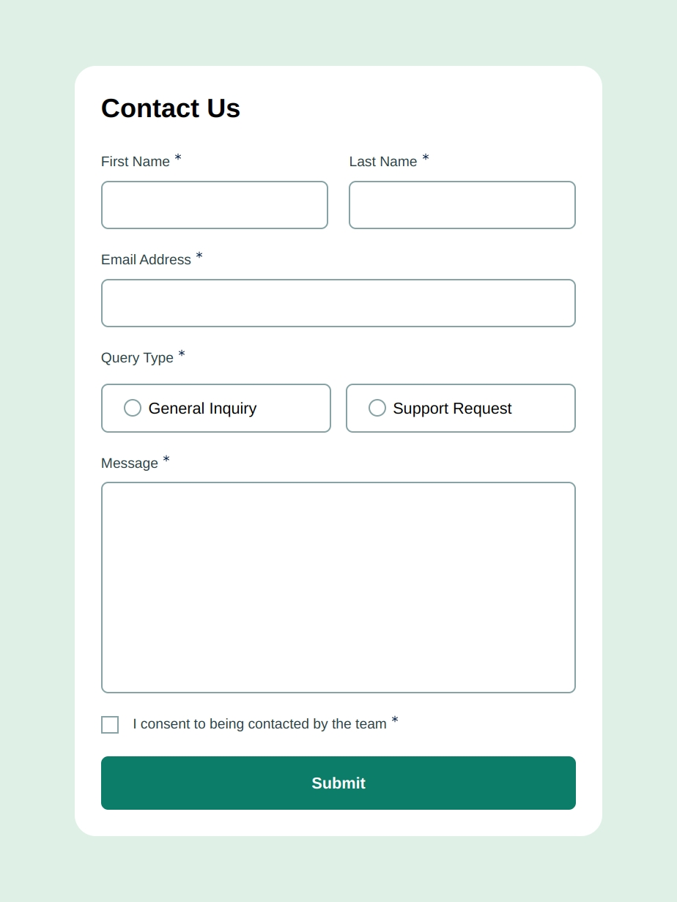
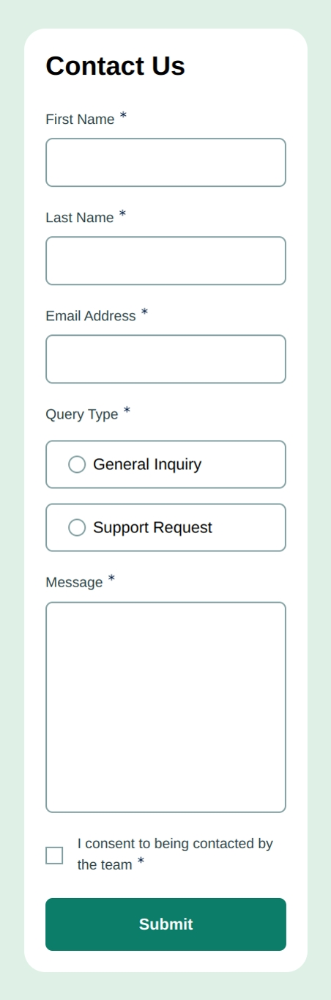

# Frontend Mentor - Contact form solution

This is a solution to the [Contact form challenge on Frontend Mentor](https://www.frontendmentor.io/challenges/contact-form--G-hYlqKJj). Frontend Mentor challenges help you improve your coding skills by building realistic projects.

## Table of contents

- [Frontend Mentor - Contact form solution](#frontend-mentor---contact-form-solution)
  - [Table of contents](#table-of-contents)
  - [Overview](#overview)
    - [The challenge](#the-challenge)
    - [Screenshot](#screenshot)
    - [Links](#links)
  - [My process](#my-process)
    - [Built with](#built-with)
    - [What I learned](#what-i-learned)
    - [Continued development](#continued-development)
  - [Author](#author)

## Overview

### The challenge

Users should be able to:

- Complete the form and see a success toast message upon successful submission
- Receive form validation messages if:
  - A required field has been missed
  - The email address is not formatted correctly
- Complete the form only using their keyboard
- Have inputs, error messages, and the success message announced on their screen reader
- View the optimal layout for the interface depending on their device's screen size
- See hover and focus states for all interactive elements on the page

### Screenshot





### Links

- Solution URL: [GitHub](https://github.com/adamskiee-frontendmentor-projects/accessible-contact-form)
- Live Site URL: [Live Site URL](https://adamskiee-frontendmentor-projects.github.io/accessible-contact-form)

## My process

### Built with

- Semantic HTML5 markup
- CSS custom properties
- Flexbox
- CSS Grid
- Mobile-first workflow
- [Tailwind](https://tailwindcss.com/) - CSS Framework
- [Tailwind Fluid](https://fluid.tw/) - For responsive design

### What I learned

- CSS Selectors

```css
.input-radio:checked + .input-radio-custom {
    @apply bg-[url(../images/icon-radio-selected.svg)] bg-no-repeat bg-cover bg-center border-none;
}
.input-radio-wrapper:has(> .input-radio:checked) {
    @apply bg-green-200-lighter
}
.input-checkbox:checked + .input-checkbox-custom {
    @apply bg-[url(../images/icon-checkbox-check.svg)] bg-no-repeat bg-contain bg-center border-none;
}
.input-checkbox:focus + .input-checkbox-custom {
    @apply border-green-600-medium
}
```

- Accessiblity

```html
<div class="form-control">
  <label class="label" for="email" id="email-label">
    Email Address
    <svg aria-hidden="true" focusable="false" width="10" height="10">
      <use href="#icon-asterisk"></use>
    </svg>
    <span class="sr-only">Required</span>
  </label>
  <input
    type="email"
    id="email"
    class="input-field input"
    name="email"
    autocomplete="email"
    aria-invalid="false"
    aria-describedby="email-error"
    required
  />
  <span id="email-error" class="error-msg hidden"
    >Please enter a valid email address</span
  >
</div>
```

- Using `svg` element

```html
<svg class="hidden" aria-hidden="true">
  <symbol id="icon-asterisk" viewBox="0 0 24 24">
    <!-- ...existing code... -->
  </symbol>
</svg>
```

### Continued development

1. I wanted to know more screen reader software for linux that have capabilitiy to turn its voice into text.

## Author

- Frontend Mentor - [@Adamskiee](https://www.frontendmentor.io/profile/Adamskiee)
